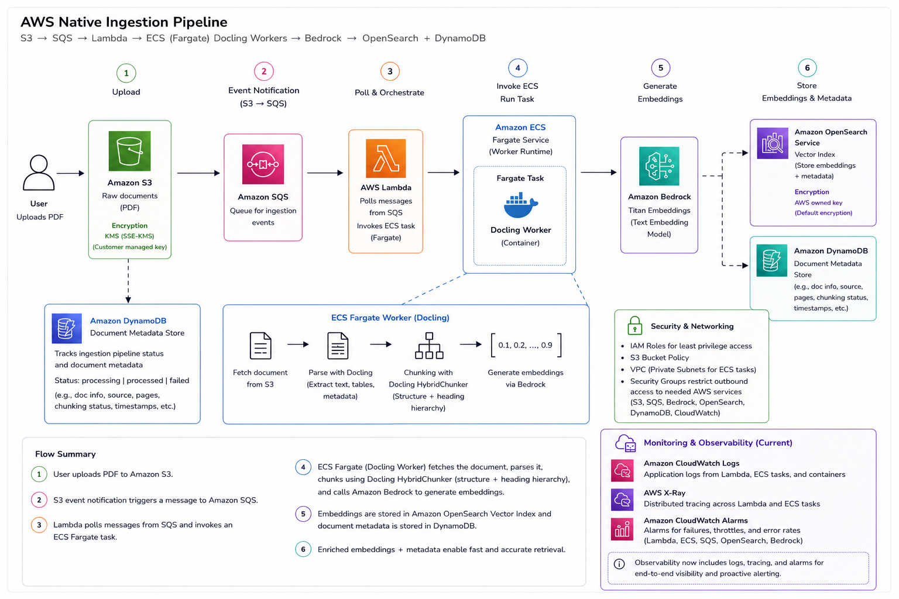

# AWS Deployment

This is the fully serverless, event-driven version of the ingestion pipeline. Every document gets its own ECS Fargate task spun up on demand and the whole system scales to zero when nothing is being processed.

## How it works



When you upload a file to S3, an event notification fires to SQS. A Lambda function picks up the message and launches a Fargate task with the S3 location passed as environment variables. The Fargate task downloads the file, runs it through Docling, chunks it, generates embeddings via Bedrock, and indexes everything into OpenSearch Serverless through a VPC endpoint. No NAT Gateway required.

```
Upload to S3
     ↓
S3 event notification to SQS
     ↓
Lambda reads the message and starts a Fargate task
     ↓
Fargate task:
  Download from S3 → Parse with Docling → Chunk → Embed with Bedrock → Index in OpenSearch
```

## What you need before deploying

You will need an AWS account with administrator access, the AWS CLI installed and configured, Terraform version 1.7 or higher, and Docker. You also need an existing VPC with at least one subnet, because the ECS tasks and the OpenSearch VPC endpoint both run inside it.

If you do not have a VPC yet, run these commands to find your default one:

```bash
aws ec2 describe-vpcs --filters "Name=isDefault,Values=true" --query "Vpcs[0].VpcId" --output text --region eu-west-2

aws ec2 describe-subnets --filters "Name=defaultForAz,Values=true" --query "Subnets[*].SubnetId" --output text --region eu-west-2

aws ec2 describe-security-groups --filters "Name=group-name,Values=default" --query "SecurityGroups[0].GroupId" --output text --region eu-west-2
```

## Deploying the infrastructure

Create a file called terraform.tfvars inside the aws/terraform folder with your values:

```hcl
vpc_id             = "your-vpc-id"
subnet_ids         = ["your-subnet-id", "your-second-subnet-id"]
security_group_ids = ["your-security-group-id"]
route_table_ids = [ "your-route-table-id" ]
```

Then run:

```bash
cd aws/terraform
terraform init
terraform apply
```

Terraform will create the S3 bucket, SQS queues, Lambda function, ECS cluster, ECR repository, OpenSearch Serverless collection, VPC endpoint, and all the IAM roles needed to wire them together.

## Building and pushing the Docker image

After the infrastructure is up, build the worker image and push it to ECR. The build must target linux/amd64 because ECS Fargate runs on Intel processors, and if you are on a Mac with Apple Silicon the default build platform will not match.

```bash
cd aws/workers/docling-worker

docker build --platform linux/amd64 -t ingestion-pipeline-worker .

ECR_URL=$(aws ecr describe-repositories --repository-names ingestion-pipeline/docling-worker --region eu-west-2 --query "repositories[0].repositoryUri" --output text)

aws ecr get-login-password --region eu-west-2 | docker login --username AWS --password-stdin $ECR_URL

docker tag ingestion-pipeline-worker:latest $ECR_URL:latest
docker push $ECR_URL:latest
```

The ECR login token expires after 12 hours. If you get a 403 error on push, just run the login command again.

## Testing the pipeline

Upload any supported document to the S3 bucket to trigger the full pipeline:

```bash
aws s3 cp your-document.pdf s3://ingestion-pipeline-raw/upload/raw/doc-001/your-document.pdf --region eu-west-2
```

Watch the logs to see what the task is doing:

```bash
aws logs tail /ecs/ingestion-pipeline/docling-worker --follow --region eu-west-2
```

When it finishes you will see a line like `Done — 17 chunks for doc-001`.

## Embeddings

The worker calls Bedrock Titan Embed v2 as the primary embedding model. If the account has a low request quota and Titan gets throttled, the worker automatically falls back to Cohere Embed English v3 after two retries and uses Cohere for the rest of that batch. Both models produce 1024-dimension embeddings so the OpenSearch index mapping stays consistent regardless of which model was used.

## Viewing your data

Open the OpenSearch Dashboards URL from the AWS console under Amazon OpenSearch Serverless. Go to Dev Tools and run:

```json
GET /document-chunks/_search
{
  "query": { "match_all": {} },
  "size": 10,
  "_source": ["chunk_id", "document_id", "text", "chunk_type", "heading_path", "page_start", "page_end"]
}
```

If Discover shows no results, change the time filter in the top right corner to a wider range such as the last year. The chunks do not have a timestamp field so the default 15-minute window will show nothing.

## Running the tests

```bash
cd aws/workers/docling-worker
python3 -m pytest tests/ -v
```

## Supported file types

PDF, DOCX, TXT, MD, CSV and JSON.
